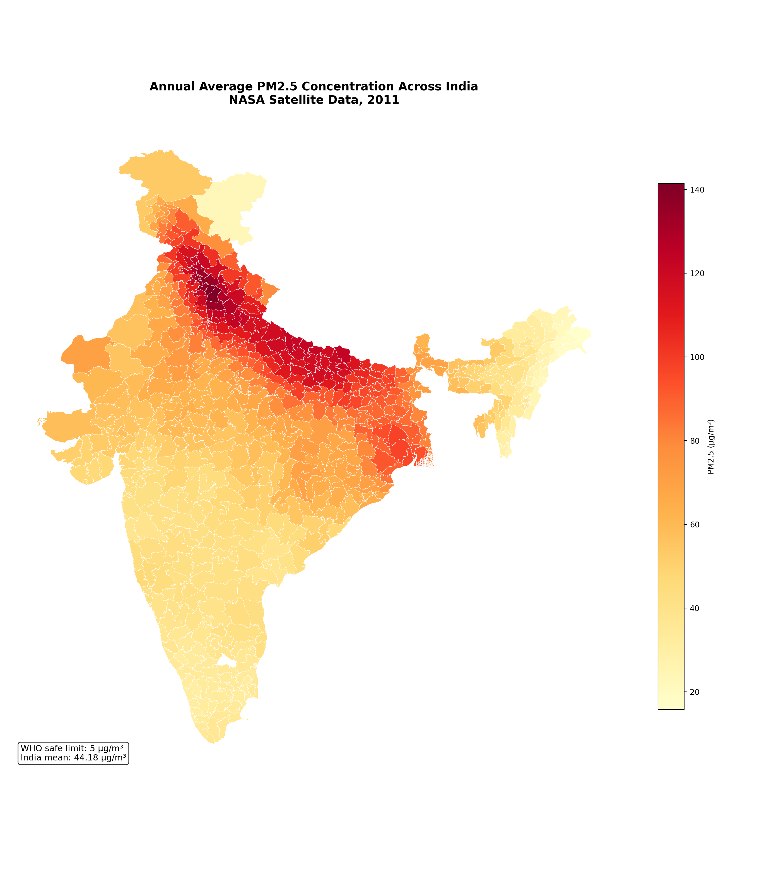
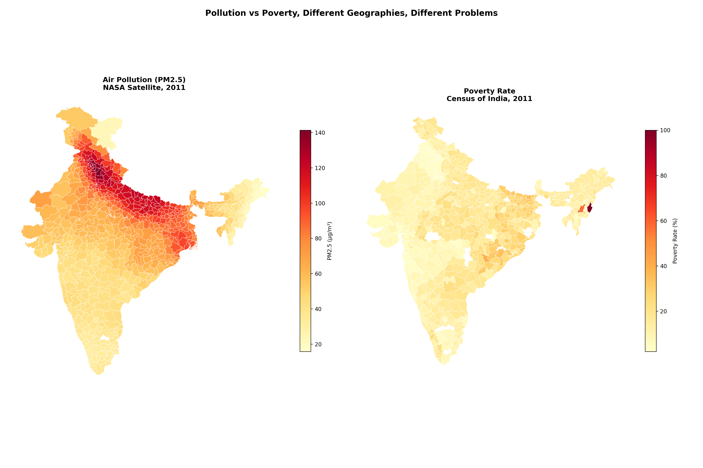
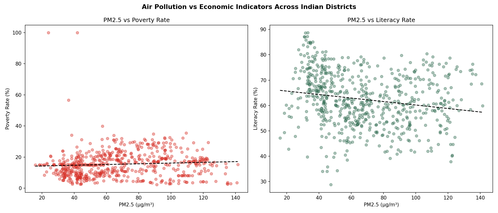
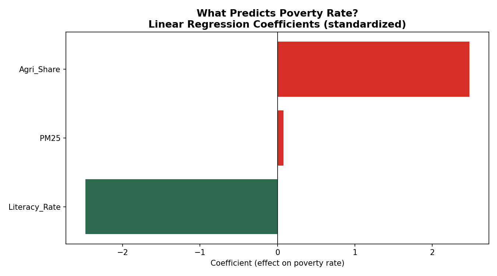

# Air Pollution and Economic Outcomes in Indian Districts

An environmental economics research project examining whether air 
pollution independently predicts poverty and economic outcomes across 
622 Indian districts. Uses real NASA satellite PM2.5 data merged with 
Census 2011 socioeconomic indicators.

---

## Research Question

Does air pollution independently predict poverty at the district level 
in India, after controlling for literacy and agricultural dependence?

---

## Data Sources

**Air Quality:** NASA/Columbia University Global Annual PM2.5 Grids 
(MODIS, MISR, SeaWiFS AOD), V4.GL.03, 2011. A 1.7GB global raster 
file processed and cropped to India at 0.01 degree resolution.

**Socioeconomic:** Census of India 2011, district level, 640 districts, 
116 variables. Publicly available.

**Geographic:** Census 2011 district shapefiles via DataMeet India.

---

## Key Findings

**Finding 1: India's air quality crisis is severe**
India's mean district-level PM2.5 in 2011 was 44.18 µg/m³, nearly 
nine times the WHO annual safe limit of 5 µg/m³. The most polluted 
district, Saharanpur (UP), recorded 141.4 µg/m³ 28 times the safe 
limit.

**Finding 2: Pollution and poverty occupy different geographies**
The raw correlation between PM2.5 and poverty rate across districts 
is only 0.075, close to zero. The Indo-Gangetic Plain is India's most 
polluted belt but is not uniformly its poorest. Poverty is concentrated 
in agriculturally dependent districts regardless of pollution levels.

**Finding 3: PM2.5 has no independent effect on poverty**
After controlling for literacy rate and agricultural dependence in a 
linear regression, PM2.5 has a standardized coefficient of just 0.08 
on poverty rate. Literacy rate (-2.48) and agricultural dependence 
(+2.48) are the dominant predictors. The model explains 22% of 
poverty variation (R² = 0.22).

**Finding 4: Literacy is the strongest economic predictor**
Across all models, literacy rate is the single strongest predictor 
of both lower poverty and lower agricultural dependence at the 
district level.

---

## Policy Implication

Clean air policy and poverty reduction policy need to target different 
districts. The assumption that pollution reduction automatically reduces 
poverty would be a policy error in the Indian context. The two 
challenges require separate, independently designed interventions.

---

## Limitations

- Data is from 2011. Both pollution levels and economic conditions 
  have changed significantly since then.
- PM2.5 values are sampled at district centroids rather than averaged 
  across the full district area. Districts with complex terrain or 
  large area may have less representative values.
- The regression model explains only 22% of poverty variation, 
  indicating significant omitted variables. A more complete model 
  would include industrial output, urbanization rate, health 
  infrastructure, and historical land use.
- Correlation and regression do not establish causation. The findings 
  describe associations, not causal effects.

---

## Visualizations

### PM2.5 concentration map of India

### Pollution vs poverty, different geographies

### PM2.5 vs economic indicators scatter plots

### Regression coefficients

---

## Methodology

1. Downloaded NASA global PM2.5 GeoTIFF (1.7GB) for 2011
2. Cropped raster to India bounding box (68E-97.5E, 8N-37.5N)
3. Sampled PM2.5 value at each district centroid
4. Merged with Census 2011 on district name
5. Computed literacy rate, poverty rate, agricultural share, 
   and affluence rate from raw census variables
6. Ran correlation analysis and standardized linear regression
7. Produced side by side choropleth maps for visual comparison

---

## Tools

Python, Pandas, NumPy, PIL, GeoPandas, Scikit-learn, 
Matplotlib, Jupyter Notebook

---

## Relationship to Other Work

This project is a companion to 
[Climate Vulnerability Assessment of Indian Districts]
(https://github.com/arshia-bajpai/india-climate-vulnerability), 
which maps socioeconomic vulnerability using Census 2011 data. 
Together the two projects examine different dimensions of 
environmental risk in India, climate exposure and air quality,
using consistent data and methods.

---

## About

Independent research project by Arshia Bajpai, final-year BSc 
Environmental Studies with Economics minor, TERI School of Advanced 
Studies, New Delhi.

Code and notebooks available in this repository.
